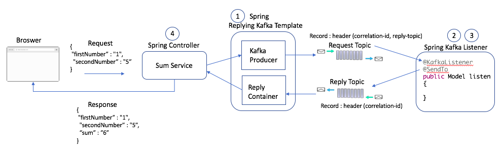

# rest-kafka

* [Description](#description)
* [API](#api)

## Description
Rest via Kafka
With the latest release of Spring-Kafka, request-reply semantics are available off-the-shelf. 
This example demonstrates the simplicity of the Spring-Kafka implementation.

The first connotation that comes to mind when Kafka is brought up is a fast, asynchronous processing system. 
Request-reply semantics are not natural to Kafka. In order to achieve the request-reply pattern, 
the developer has to build a system of correlation IDs in the producer records and match that in the consumer records.

With the latest release of Spring-Kafka, these request-reply semantics are now available off-the-shelf. 
This example demonstrates the simplicity of the Spring-Kafka implementation.

The below picture is a simple demonstrative service to calculate the sum of two numbers that requires synchronous behavior to return the result.

[Based on article](https://dzone.com/articles/synchronous-kafka-using-spring-request-reply-1)

## API
[UI Swagger API](http://localhost:8080/swagger-ui/index.html)
